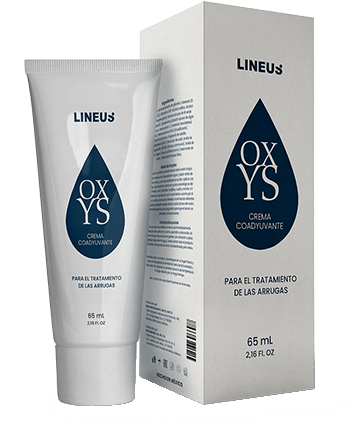

# 📋 Завдання до модуля 7 "Робота з лендінгами"

## 📄 Опис завдання:

Потрібно внести зміни на лендінгу та додати необхідні доопрацювання ленда по завданню. Зробити переклад ленда, та адаптацію.

## ✏️ Зміни на лендінгу:

> [!NOTE]
> У папці `landing` лежать файли лендінгу до завдання.

1. Перевірити валідність коду лендінга. Виправити помилки валідної верстки, якщо вони є.
2. Доверстати форму для збору даних користувачів у `div id="SECTION5"`, форма має включати поля: Ім'я, Номер телефону та кнопку відправки. Форма має бути по кольорам та дизайну схожому на сайт.
3. Зробити адаптацію лендінгу, замінити банку оффера, назву, та ціну. Картинку взяти у репозиторії, або ось лінк на .
> [!NOTE]
> Назва офферу: `OXYS`, ціна на ленді: `790 MXN`, гео: Мексика.

4. Через google translate, або аналогічний перекладач перекласти ленд на `іспанську мову`.
5. Знайти у гугл або на стоках зображення жінок більш схожих на іспанок та замінити ними ті, що є у ленді. Ленд буде на для Латинської Америки, тому треба повна адаптація під це гео.

### ⚠️ Вимоги до виконання домашнього завдання:
1. Скопіювати репозиторій з лендом, та внести необхідні зміни у нього.
2. Зробити адаптацію, переклад.
3. Виконане домашнє завдання запакувати у архів та відправити на перевірку до наступного заняття.

Бажаємо успіху! 🚀

